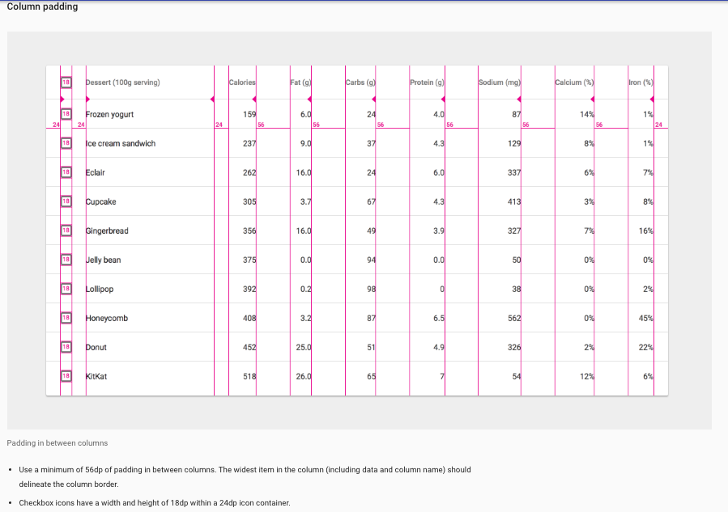
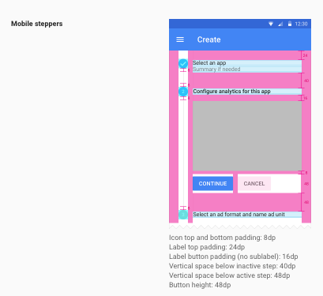

# Char: The Baker's Friend
## An Android baking recipe app

A basic recipe app that utilizes Firebase's real-time database and the YouTube in cooperation with Google Android features. This is a course project for the Udacity Android Developer Nanodgree program with ambiguous requirements, so I get to creatively design the app in accordance to the rubric specifications.  

## _Implements_

- Cards for the Launch Activity's recipe list
    - 
    - [source](https://material.io/guidelines/components/cards.html#cards-usage)
    - Actions will include ShareActionProvider & an Intent to the onClick's DetailFlow MainActivity
- Data Tables for the DetailFlow's MainActivity ingredients list item
    - 
    - 
    - 
    - [source](https://material.io/guidelines/components/data-tables.html)
- Vertical Steppers for the DetailFlowActivity's recipe steps & video
    - 
    - 
    - 
    - 
    - [source](https://material.io/guidelines/components/steppers.html#steppers-specs)
- fixed bottom navigation on the phone UI for the DetailFlow's DetailActivity
    - 
    - 
    - 
    - [source](https://material.io/guidelines/components/bottom-navigation.html#bottom-navigation-specs)
    - 
    [source](https://material.io/guidelines/components/steppers.html#steppers-specs)
    - Actions will include 'last' & 'next' with step progress metric

***

_Android Technologies:_

- Accessibility
- Spanish, French, Arabic (i.e., right to left) translation
- Parcelable object packaging
- Espresso testing
- widgets
- detail flow activity
- SVG assets
- Fragments
- SwipeRefreshLayout
- tablet + phone layouts
- recyclerView with heterogeneous XML layouts
- custom adapters
- ShareActionProvider
- Facebook Stetho
- Square Picasso image rendering
- Square RetroFit / Google GSON
- Firebase real-time database

## _Sources_

- [Udacity Android Developer Nanodegree project rubric](https://classroom.udacity.com/nanodegrees/nd801/parts/3be77470-96de-400a-bbfb-2ae4cc924d48/modules/fef52d54-0038-4a84-9d11-feedc914d310/lessons/8703012d-d830-4748-bb64-ae1796d687ec/concepts/16d87c7d-a648-4c0c-be4e-e88fb5f1ac6b)
- [Google Android Development Guidelines](https://developer.android.com/develop/index.html)
- [Google Material Design Guidelines](https://material.io/guidelines/)
- [Genymotion Android emulator](https://www.genymotion.com/)
- [Creative commons images](https://search.creativecommons.org/)

***

J. Clark (c) June 2017